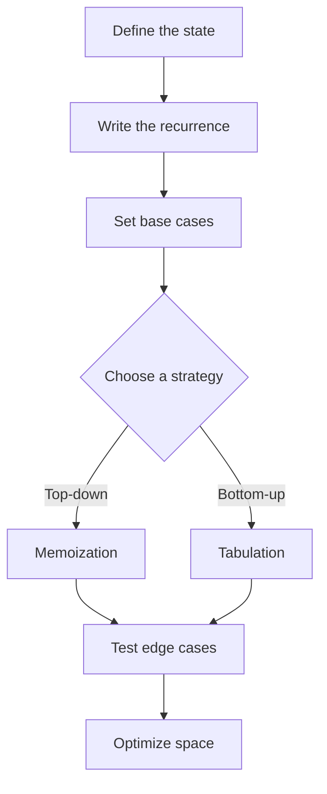

<div align="center">


[](https://git.io/typing-svg)


[](https://github.com/zaidmoen/Dynamic-Programming/actions/workflows/tests.yml)


</div>

## About

A structured, dependency-free collection of classic algorithms implemented in
modern Python. The repository is designed for learning and interview practice:
every solution includes a clear API, complexity analysis, input validation, a
runnable example, and automated tests.

## Algorithm Catalog

| Level | Topic | Pattern | Time | Implementation |
|---|---|---|---:|---|
| Beginner | Fibonacci | Memoization and tabulation | O(n) | [`fibonacci.py`](fibonacci/fibonacci.py) |
| Beginner | Divide & Conquer | Split, solve, combine | O(n log n) | [`divide_and_conquer.py`](divide_and_conquer/divide_and_conquer.py) |
| Beginner | Binary Search Tree | Recursive structure | O(h) average | [`binary_search_tree.py`](trees/binary_search_tree.py) |
| Intermediate | Unique Grid Paths | Two-dimensional state | O(rows × columns) | [`grid_paths.py`](grid_paths/grid_paths.py) |
| Intermediate | Coin Change | Unbounded choice | O(amount × coins) | [`coin_change.py`](coin_change/coin_change.py) |
| Intermediate | 0/1 Knapsack | Capacity and choice | O(n × capacity) | [`knapsack.py`](knapsack/knapsack.py) |
| Intermediate | Longest Common Subsequence | Two sequences | O(m × n) | [`lcs.py`](longest_common_subsequence/lcs.py) |
| Intermediate | Edit Distance | String transformation | O(m × n) | [`edit_distance.py`](edit_distance/edit_distance.py) |
| Advanced | Longest Increasing Subsequence | DP with binary search | O(n log n) | [`lis.py`](longest_increasing_subsequence/lis.py) |

## How Dynamic Programming Works



Dynamic programming is useful when a problem has **overlapping subproblems**
and **optimal substructure**. The hard part is rarely writing the loop—the hard
part is deciding what each state means.

Read the [DP Pattern Cheat Sheet](DP_CHEAT_SHEET.md) for a compact problem-solving
framework.

## Repository Structure

```text
Dynamic-Programming/
├── .github/workflows/              # Continuous integration
├── tests/                          # Automated regression tests
├── fibonacci/                      # Memoization vs. tabulation
├── grid_paths/                     # Grid DP with obstacles
├── coin_change/                    # Minimum coins and combinations
├── knapsack/                       # 0/1 choice DP
├── longest_common_subsequence/     # Two-sequence DP
├── edit_distance/                  # String transformation DP
├── longest_increasing_subsequence/ # O(n log n) reconstruction
├── divide_and_conquer/             # Merge sort and binary search
├── trees/                          # Binary search tree fundamentals
├── DP_CHEAT_SHEET.md
└── README.md
```

## Quick Start

```bash
git clone https://github.com/zaidmoen/Dynamic-Programming.git
cd Dynamic-Programming

python fibonacci/fibonacci.py
python grid_paths/grid_paths.py
python longest_increasing_subsequence/lis.py
```

No external packages are required.

Run the complete test suite:

```bash
python -m unittest discover -s tests -v
```

## Recommended Learning Path

1. Compare recursion, memoization, and tabulation with **Fibonacci**.
2. Learn recursive decomposition with **Divide & Conquer** and **Trees**.
3. Define a one-dimensional state with **Coin Change**.
4. Move to grid and capacity states with **Unique Paths** and **Knapsack**.
5. Practice two-sequence transitions with **LCS** and **Edit Distance**.
6. Finish with the optimized **Longest Increasing Subsequence** solution.

## Quality Standards

- Python 3.10+ type hints
- Documented time and space complexity
- Explicit edge-case validation
- Runnable examples
- Standard-library-only test suite
- CI verification on Python 3.10 through 3.13

## Contributing

Contributions are welcome. Keep implementations readable, document the state
and recurrence, include complexity analysis, and add tests for normal and edge
cases.

---

<div align="center">
Built for consistent algorithm practice and stronger problem-solving skills.
</div>
